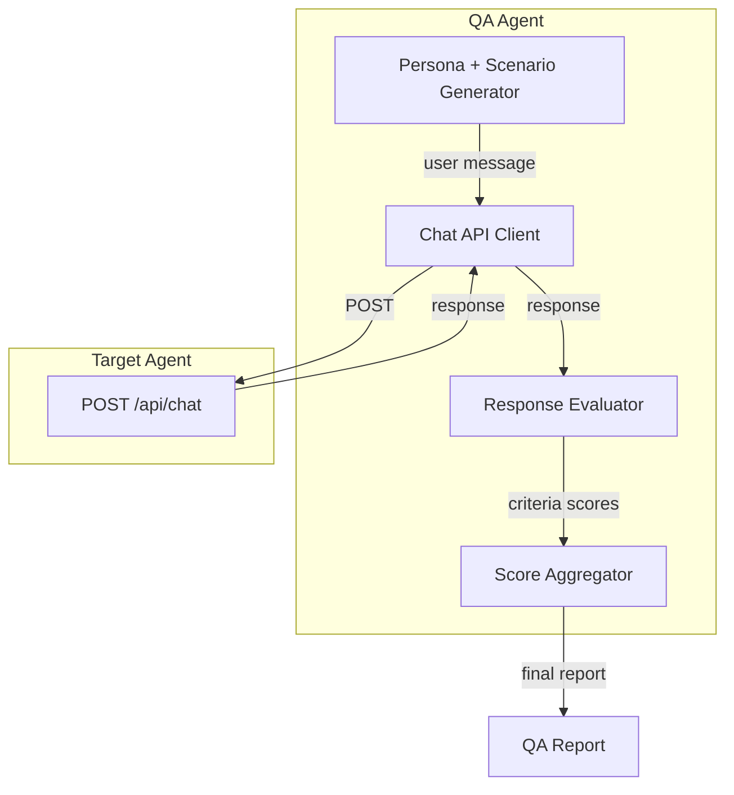

# QA Agent for SimilarWeb Onboarding Agent

## Overview

Build a QA agent that programmatically tests the SimilarWeb onboarding agent by simulating diverse user types, running multi-turn conversations, and evaluating responses against defined quality criteria. Output: a scored report with pass/fail and rationale.

---

## Architecture




---

## 1. User Personas and Scenarios

Define personas that mirror real users, each with quiz state and message sequences. Each persona has multiple example messages to test variety and robustness.

**Evaluation fields per question:**

- **Expected answers:** What a good response should contain or convey
- **Good keywords:** If present in responseText or suggestedPages, answer is probably good
- **Bad keywords:** If present in responseText, answer is probably bad (e.g. banned phrases, plain-text suggestions)
- **Expected intent:** Intent category the agent should route to
- **Expected suggestedPages:** Valid page IDs that would be correct (subset; agent may pick others from mapping)

---

### New Explorer

**Quiz:** primaryFocus: analyze-competitors-market, subFocuses: [traffic-sources]


| Question                                                 | Expected answers                                                            | Good keywords                                                         | Bad keywords                                          | Expected intent | Expected suggestedPages                                     |
| -------------------------------------------------------- | --------------------------------------------------------------------------- | --------------------------------------------------------------------- | ----------------------------------------------------- | --------------- | ----------------------------------------------------------- |
| "Hi"                                                     | Greeting by name, brief acknowledgment of goals, suggest 2–3 pages to start | traffic, Traffic & Engagement, marketing-channels, visits, engagement | Want a quick tour, Explore further, I'm also here for | greeting        | traffic-engagement, marketing-channels, website-performance |
| "Where can I find traffic data?"                         | Direct answer: Traffic & Engagement, Marketing Channels; suggest pages      | traffic, Traffic & Engagement, marketing-channels, visits             | —                                                     | navigation      | traffic-engagement, marketing-channels                      |
| "What should I look at next?"                            | Next steps aligned with traffic-sources sub-focus                           | traffic, marketing-channels, incoming-traffic, next                   | —                                                     | recommendation  | marketing-channels, incoming-traffic, traffic-engagement    |
| "How do I benchmark my site against competitors?"        | Benchmarking pages: traffic-engagement, similar-sites, website-performance  | benchmark, traffic-engagement, similar-sites, compare                 | —                                                     | navigation      | traffic-engagement, similar-sites, website-performance      |
| "Where do I see market share?"                           | Market share on Traffic & Engagement or Market Overview                     | market share, Traffic & Engagement, market-overview                   | —                                                     | navigation      | traffic-engagement, market-overview                         |
| "What metrics can I use to understand audience loyalty?" | New vs Returning, engagement metrics, Traffic & Engagement                  | loyalty, New vs Returning, engagement, traffic-engagement             | —                                                     | navigation      | traffic-engagement, demographics                            |


---

### SEO Manager

**Quiz:** primaryFocus: improve-seo-ppc, subFocuses: [keyword-research-gap]


| Question                                                        | Expected answers                                           | Good keywords                                            | Bad keywords | Expected intent | Expected suggestedPages              |
| --------------------------------------------------------------- | ---------------------------------------------------------- | -------------------------------------------------------- | ------------ | --------------- | ------------------------------------ |
| "Where can I find best keywords to bid on?"                     | Keyword Generator, Search Overview                         | keyword, Keyword Generator, search-overview, bid         | —            | navigation      | keyword-generator, search-overview   |
| "I just navigated to Keyword Generator. What can I learn here?" | One useful thing to do first; next steps (not yet visited) | keyword, gap, ideas, search                              | —            | explanation     | search-overview, rank-tracker        |
| "How do I analyze keyword competition?"                         | Keyword Generator, Search Overview                         | keyword, competition, keyword-generator, search-overview | —            | navigation      | keyword-generator, search-overview   |
| "Where can I track my search rankings?"                         | Rank Tracker, Search Overview                              | rank, Rank Tracker, search-overview, position            | —            | navigation      | rank-tracker, search-overview        |
| "What pages help with backlink research?"                       | Backlinks Overview, Incoming Traffic                       | backlink, Backlinks Overview, incoming-traffic           | —            | navigation      | backlinks-overview, incoming-traffic |
| "How can I see competitor ad strategies?"                       | Ad Intelligence, Marketing Channels                       | ad, Ad Intelligence, marketing-channels, competitor      | —            | navigation      | ad-intelligence, marketing-channels  |


---

### GenAI Curious

**Quiz:** primaryFocus: genai-visibility


| Question                                                        | Expected answers                               | Good keywords                                    | Bad keywords | Expected intent | Expected suggestedPages |
| --------------------------------------------------------------- | ---------------------------------------------- | ------------------------------------------------ | ------------ | --------------- | ----------------------- |
| "How do I track AI traffic to my site?"                         | Gen AI Intelligence page                       | Gen AI, AI traffic, gen-ai-intelligence, chatbot | —            | navigation      | gen-ai-intelligence     |
| "Where can I see Gen AI brand visibility?"                      | Gen AI Intelligence                            | Gen AI, visibility, brand, gen-ai-intelligence   | —            | navigation      | gen-ai-intelligence     |
| "What metrics show how often my brand appears in AI responses?" | Gen AI Intelligence, citations, brand mentions | Gen AI, citations, brand, AI responses           | —            | navigation      | gen-ai-intelligence     |
| "How do I analyze citations from ChatGPT?"                      | Gen AI Intelligence, citation tracking         | citations, ChatGPT, gen-ai-intelligence          | —            | navigation      | gen-ai-intelligence     |


---

### On-Page User

**Quiz:** (none) | **Context:** currentPageId: traffic-engagement


| Question                                                    | Expected answers                               | Good keywords                                         | Bad keywords | Expected intent | Expected suggestedPages                               |
| ----------------------------------------------------------- | ---------------------------------------------- | ----------------------------------------------------- | ------------ | --------------- | ----------------------------------------------------- |
| "What does bounce rate mean?"                               | Definition; reference to current page          | bounce rate, leave, single page, engagement           | —            | explanation     | marketing-channels, demographics                      |
| "What else can I explore?"                                  | Sibling pages not yet visited                  | marketing-channels, demographics, website-performance | —            | recommendation  | marketing-channels, demographics, website-performance |
| "How do I interpret the engagement metrics?"                | Explanation of engagement metrics on this page | engagement, visits, duration, pages per visit         | —            | explanation     | marketing-channels, website-performance               |
| "Where can I drill down into traffic sources?"              | Marketing Channels, Incoming Traffic           | traffic sources, marketing-channels, incoming-traffic | —            | navigation      | marketing-channels, incoming-traffic                  |
| "What's the difference between visits and unique visitors?" | Clear distinction                              | visits, unique visitors, sessions, users             | —            | explanation     | —                                                     |


---

### Sales Seeker

**Quiz:** (none)


| Question                    | Expected answers                                               | Good keywords                                  | Bad keywords            | Expected intent               | Expected suggestedPages |
| --------------------------- | -------------------------------------------------------------- | ---------------------------------------------- | ----------------------- | ----------------------------- | ----------------------- |
| "What's the price?"         | No pricing details; redirect to Subscription/Packages or Sales | Subscription, Packages, Contact Sales, sales   | specific dollar amounts | routing-sales or subscription | —                       |
| "I want to book a demo"     | Acknowledge, offer to connect                                  | demo, Contact Sales, Schedule Demo             | —                       | routing-sales                 | —                       |
| "How do I upgrade my plan?" | Redirect to Subscription, Packages, or Sales                   | Subscription, Packages, upgrade, Contact Sales | —                       | routing-sales or subscription | —                       |
| "I need enterprise pricing" | Connect with sales; no specific pricing                        | enterprise, Contact Sales, sales               | —                       | routing-sales                 | —                       |
| "Can I get a trial?"        | Acknowledge, offer Sales or Subscription                       | trial, Contact Sales, Subscription             | —                       | routing-sales                 | —                       |


**Quick actions expected:** Contact Sales, Schedule Demo when sales intent.

---

### Support Seeker

**Quiz:** (none)


| Question                             | Expected answers                            | Good keywords                               | Bad keywords | Expected intent                    | Expected suggestedPages |
| ------------------------------------ | ------------------------------------------- | ------------------------------------------- | ------------ | ---------------------------------- | ----------------------- |
| "Something is broken"                | Empathize, offer support or step-by-step    | support, Contact Support, Help Center, help | —            | routing-support                    | —                       |
| "I need help"                        | Offer support, Help Center                  | support, Help Center, Contact Support       | —            | routing-support                    | —                       |
| "I'm getting an error when I export" | Acknowledge, offer support or guidance      | export, support, Contact Support, error     | —            | routing-support or troubleshooting | —                       |
| "How do I contact support?"          | Direct answer: Contact Support, Help Center | Contact Support, Help Center                | —            | routing-support                    | —                       |
| "My billing is wrong"                | Empathize, offer support                    | billing, support, Contact Support           | —            | routing-support                    | —                       |


**Quick actions expected:** Contact Support, Help Center when support intent.

---

### Vague Greeter

**Quiz:** (none)


| Question           | Expected answers                                           | Good keywords                                 | Bad keywords                       | Expected intent | Expected suggestedPages                 |
| ------------------ | ---------------------------------------------------------- | --------------------------------------------- | ---------------------------------- | --------------- | --------------------------------------- |
| "Help"             | Greet, offer to help, suggest 2–3 starting pages           | help, explore, traffic, website               | Want a quick tour, Explore further | greeting        | traffic-engagement, website-performance |
| "What can you do?" | Brief description of assistant capabilities, suggest pages | navigate, explore, traffic, keywords, support | —                                  | greeting        | traffic-engagement, keyword-generator   |
| "Hi there"         | Friendly greeting, suggest starting points                 | hi, explore, traffic                          | —                                  | greeting        | traffic-engagement, website-performance |
| "I'm new here"     | Welcome, suggest 2–3 pages to start                        | welcome, explore, traffic, start              | —                                  | greeting        | traffic-engagement, website-performance |


---

### Follow-up Tester

**Quiz:** (varies by sub-scenario)

- First message (e.g. "Where can I find traffic data?"), then:
  - "take me there" / "yes" / "lets do it" / "show me that page"


| Question                                   | Expected answers                                                                                   | Good keywords                          | Bad keywords                  | Expected intent   | Expected suggestedPages             |
| ------------------------------------------ | -------------------------------------------------------------------------------------------------- | -------------------------------------- | ----------------------------- | ----------------- | ----------------------------------- |
| "take me there" (after traffic suggestion) | Use EXACT page IDs from prior suggestedPages; navigate to traffic-engagement or marketing-channels | traffic-engagement, marketing-channels | different page IDs than prior | action/navigation | Same IDs as prior suggestedPages[0] |
| "yes" / "lets do it" / "show me that page" | Same as above; exact match to prior suggestion                                                     | (page ID from prior turn)              | —                             | action/navigation | Same IDs as prior suggestedPages    |


**Evaluation:** suggestedPages in follow-up MUST match prior suggestedPages exactly (no new/different pages).

---

### Market Analyst

**Quiz:** primaryFocus: analyze-competitors-market, subFocuses: [market-share-shifts]


| Question                                 | Expected answers                                  | Good keywords                                                   | Bad keywords | Expected intent | Expected suggestedPages                           |
| ---------------------------------------- | ------------------------------------------------- | --------------------------------------------------------------- | ------------ | --------------- | ------------------------------------------------- |
| "How do I track market share shifts?"    | Market Overview, Market Players, Website Rankings | market share, market-overview, market-players, website-rankings | —            | navigation      | market-overview, market-players, website-rankings |
| "Where can I find emerging competitors?" | Market Players, Similar Sites                     | emerging, market-players, similar-sites, competitors            | —            | navigation      | market-players, similar-sites                     |
| "What page shows industry trends?"       | Market Overview, Demand Analysis                  | industry, trends, market-overview, demand-analysis              | —            | navigation      | market-overview, demand-analysis                  |
| "How do I benchmark against the market?" | Market Overview, Traffic & Engagement             | benchmark, market-overview, traffic-engagement                  | —            | navigation      | market-overview, traffic-engagement              |


---

### Audience Researcher

**Quiz:** primaryFocus: analyze-competitors-market, subFocuses: [understand-audience]


| Question                                       | Expected answers   | Good keywords                                     | Bad keywords | Expected intent | Expected suggestedPages |
| ---------------------------------------------- | ------------------ | ------------------------------------------------- | ------------ | --------------- | ----------------------- |
| "Where can I see demographics?"                | Demographics page  | demographics, age, gender                         | —            | navigation      | demographics            |
| "How do I understand my audience's interests?" | Audience Interests | audience, interests, affinity, audience-interests | —            | navigation      | audience-interests      |
| "What page shows geography breakdown?"         | Geography page     | geography, country, region                        | —            | navigation      | geography               |
| "Where do I find audience overlap?"            | Audience Overlap   | audience overlap, audience-overlap                | —            | navigation      | audience-overlap        |


---

### Non-English Speaker

**Quiz:** (varies) | **Purpose:** Test handling of non-English input. Expected answers = same as English equivalent; agent should understand and respond in kind or English.


| Question (EN meaning)                                      | Expected answers                                     | Good keywords                                   | Bad keywords | Expected intent |
| ---------------------------------------------------------- | ---------------------------------------------------- | ----------------------------------------------- | ------------ | --------------- |
| "¿Dónde puedo ver el tráfico...?" (traffic)                | Traffic & Engagement, Marketing Channels             | traffic, traffic-engagement, marketing-channels | —            | navigation      |
| "Comment analyser les concurrents ?" (competitors)         | Traffic & Engagement, Similar Sites, Market Overview | competitors, traffic-engagement, similar-sites  | —            | navigation      |
| "Wo finde ich Keyword-Ideen?" (keywords)                   | Keyword Generator, Search Overview                   | keyword, keyword-generator, search-overview     | —            | navigation      |
| "Como faço para ver métricas de engajamento?" (engagement) | Traffic & Engagement                                 | engagement, traffic-engagement                  | —            | navigation      |
| "Dove posso trovare dati sul traffico?" (traffic)          | Traffic & Engagement                                 | traffic, traffic-engagement                      | —            | navigation      |
| "Comment puis-je suivre le trafic AI ?" (AI traffic)       | Gen AI Intelligence                                  | Gen AI, gen-ai-intelligence, AI traffic         | —            | navigation      |


**Evaluation:** Response should be on-topic (traffic, competitors, keywords, etc.)—not "I don't understand" or generic error.

---

### Weird / Off-Topic User

**Quiz:** (none) | **Purpose:** Stress test. Good answer = politely redirect to product, NOT literal answer.


| Question                                | Expected answers                                              | Good keywords                      | Bad keywords                   | Expected intent     |
| --------------------------------------- | ------------------------------------------------------------- | ---------------------------------- | ------------------------------ | ------------------- |
| "What's the weather like today?"        | Redirect: "I help with SimilarWeb—traffic, competitors, etc." | SimilarWeb, traffic, explore, help | weather, temperature, forecast | greeting or unknown |
| "Tell me a joke"                        | Politely decline, redirect to product                         | SimilarWeb, explore, help          | joke, punchline                | unknown             |
| "What is the meaning of life?"          | Redirect to product                                           | SimilarWeb, traffic, explore       | meaning of life, philosophy    | unknown             |
| "Can you help me write a poem?"         | Politely decline, redirect                                    | SimilarWeb, explore                | poem, verse                    | unknown             |
| "asdfghjkl" / "?????"                   | Clarify or redirect; don't pretend to understand              | help, clarify, SimilarWeb          | (none—avoid hallucination)     | unknown             |
| "I'm looking for a recipe for pasta"    | Redirect to product                                           | SimilarWeb, traffic, explore       | recipe, pasta, cook            | unknown             |
| "What's 2 + 2?"                         | Brief redirect (or answer "4" then redirect)                  | SimilarWeb, explore                | —                              | unknown             |
| "Do you like pizza?"                    | Redirect to product                                           | SimilarWeb, explore                | —                              | unknown             |
| "Random question: why is the sky blue?" | Redirect or brief answer + redirect                           | SimilarWeb, explore                | —                              | unknown             |


**Evaluation:** Must NOT answer literally (e.g. tell a joke, give recipe). Should redirect to SimilarWeb capabilities.

---

### Out-of-Scope Product

**Quiz:** (none) | **Purpose:** Questions SimilarWeb doesn't offer. Good answer = polite decline, no hallucination, suggest what IS available.


| Question                                                    | Expected answers                                                           | Good keywords                                  | Bad keywords                            | Expected intent          |
| ----------------------------------------------------------- | -------------------------------------------------------------------------- | ---------------------------------------------- | --------------------------------------- | ------------------------ |
| "How do I generate leads from this platform?"               | SimilarWeb doesn't offer lead gen; suggest company/market data             | doesn't, not available, market data, company   | lead, email, contact list, export leads | unknown or routing-sales |
| "Where can I get API access?"                               | No API/developer access; redirect to Sales or product capabilities         | doesn't, not available, Contact Sales, explore | API, developer, programmatic            | unknown or routing-sales |
| "How do I export leads or contact information?"             | Not available; suggest data export (traffic, rankings) if applicable       | doesn't, not available, export, traffic        | leads, contact info, email addresses   | unknown                  |
| "Can I integrate this with Salesforce for lead enrichment?" | Not available; suggest Sales for enterprise                                | doesn't, not available, Contact Sales          | Salesforce, lead enrichment             | unknown or routing-sales |
| "Where do I find email addresses of website visitors?"      | Not available; SimilarWeb doesn't provide PII                              | doesn't, not available, privacy                | email, PII, contact                     | unknown                  |
| "How do I access the API documentation?"                    | No public API; Contact Sales                                               | doesn't, not available, Contact Sales         | API, documentation                      | unknown or routing-sales |
| "Can I get a list of companies to cold call?"               | Not lead gen; suggest Market Overview, Similar Sites for company discovery | market-overview, similar-sites, companies      | cold call, lead list                    | unknown                  |
| "Where can I download CSV of contact data?"                 | Not available; suggest export of traffic/rankings data                      | doesn't, export, traffic, rankings             | contact data, CSV of leads              | unknown                  |
| "How do I set up webhooks for real-time data?"              | Not available; Contact Sales                                               | doesn't, not available, Contact Sales         | webhooks, real-time                     | unknown or routing-sales |
| "Is there a developer API for programmatic access?"         | No public API; Contact Sales for enterprise                                | doesn't, not available, Contact Sales         | API, developer, programmatic            | unknown or routing-sales |


**Evaluation:** Must NOT hallucinate features (e.g. "Yes, go to Lead Export page"). Should clearly state unavailability when applicable.

---

## 1b. Shared Evaluation Rules

**Good keywords (global):** Any valid page ID when navigation is appropriate; "Contact Sales" / "Contact Support" when routing; concrete follow-up questions.

**Bad keywords (global, in responseText):** "Explore further", "You might also ask", "Suggested next steps", "Want a quick tour?", "I'm also here for anything else...", raw page lists in prose.

**Intent routing:** Sales/demo/pricing → routing-sales; support/help/error/billing → routing-support; "where/how" navigation → navigation.

---

Each scenario = persona + ordered list of messages. The QA agent sends them in sequence, maintaining session (same sessionId, quiz, visitedPages, currentPageId).

---

## 2. Integration with Target Agent

**API contract** (from [src/app.ts](src/app.ts) chat endpoint):

- **Request:** `POST /api/chat` with body:

```json
  { "message": "...", "sessionId": "uuid", "quiz": { "primaryFocus": "...", "subFocuses": [] }, "userName": "...", "currentPageId": "..." }
  

```

- **Response:** `{ responseText, suggestedPages, followUpQuestions, quickActions, intent, ... }`

**QA client:** HTTP client (fetch/axios) that:

- Targets configurable base URL (e.g. `http://localhost:3001` or deployed Netlify URL)
- Reuses same `sessionId` per scenario
- Updates `currentPageId` when persona "navigates" (e.g. after "take me there" we simulate navigation by setting currentPageId to the suggested page)
- Tracks `visitedPages` implicitly via session

---

## 3. Evaluation Criteria (What the QA Agent Checks)

### A. Results and Rationale

- **Answered the question:** Response directly addresses the user's request (not generic or off-topic). Use per-question good-keyword presence and bad-keyword absence from Section 1 tables as heuristics.
- **Logical rationale:** There is a clear connection between user intent and agent response (e.g. "where to find keywords" → Keyword Generator, Search Overview). Cross-check suggestedPages against expected suggestedPages.
- **Actionable:** User gets a clear next step (page to visit, action to take, or contact option)

### B. Structured Output Quality

- **suggestedPages:** When navigation/recommendation intent, 2–3 valid page IDs from [VALID PAGE IDS](src/prompts.ts) (no invented IDs)
- **followUpQuestions:** 2–3 concrete questions when appropriate (no vague "Want a quick tour?")
- **quickActions:** Sales/Support/Subscription only when user asks about pricing, support, billing
- **No plain-text suggestions:** responseText must NOT contain "Explore further", "You might also ask", "Suggested next steps", or bullet lists of pages/questions (these should be in structured fields)

### C. Response Quality

- **Conciseness:** 2–3 sentences (not verbose)
- **No banned phrases:** No "Want a quick tour?" or "I'm also here for anything else..."
- **Intent routing:** Sales questions → routing-sales; support questions → routing-support; navigation → navigation/recommendation

### D. Multi-Turn Consistency

- **Follow-through:** When user says "take me there" or "yes", agent uses the exact page IDs from prior suggestedPages
- **No repeated suggestions:** visitedPages should not be re-suggested (when currentPageId/visitedPages are provided)

### E. Persona-Specific

- **Quiz alignment:** When quiz has primaryFocus/subFocuses, suggestedPages should align with goal-to-offering mapping (not always generic traffic-engagement, website-performance)
- **Page context:** When currentPageId is set, response should reference that page when relevant

---

## 4. Scoring Model

**Per-response score (0–100):** Weighted sum of criteria. Example weights:


| Criterion                                 | Weight | Max |
| ----------------------------------------- | ------ | --- |
| Answered question                         | 20     | 20  |
| Logical rationale                         | 15     | 15  |
| Actionable                                | 10     | 10  |
| suggestedPages valid & relevant           | 15     | 15  |
| followUpQuestions present & concrete      | 10     | 10  |
| No plain-text suggestions in responseText | 10     | 10  |
| Conciseness                               | 5      | 5   |
| No banned phrases                         | 5      | 5   |
| Intent routing correct                    | 5      | 5   |
| Multi-turn consistency (when applicable)  | 5      | 5   |


**Scenario score:** Average of per-response scores in that scenario.

**Overall score:** Average of scenario scores, or weighted by scenario importance.

**Report format:**

```
QA Report - SimilarWeb Onboarding Agent
======================================
Target: http://localhost:3001
Scenarios run: 8
Total responses evaluated: 24

SCENARIO RESULTS
----------------
1. New Explorer (3 turns): 85/100
   - Turn 1: 90 - Good greeting, suggestedPages aligned with quiz
   - Turn 2: 82 - Minor: followUpQuestions could be more specific
   - Turn 3: 83 - Correct page suggestion
2. SEO Manager (2 turns): 92/100
   ...
3. Sales Seeker (1 turn): 88/100
   ...

OVERALL SCORE: 87/100

FAILURES / WARNINGS
-------------------
- Scenario "Vague Greeter" turn 1: responseText contained "Explore further" (plain text)
- Scenario "On-Page User" turn 2: suggestedPages included already-visited page
```

---

## 5. Implementation Approach

### Option A: Rule-Based Evaluator (Recommended for MVP)

- Criteria implemented as TypeScript functions (regex, array checks, string length)
- No extra LLM calls for evaluation
- Fast, deterministic, easy to debug
- Limitation: "Answered the question" and "Logical rationale" are harder to assess with rules; use heuristics (keyword overlap, intent match) or simple LLM call for those two only

### Option B: LLM-as-Judge

- Pass (user message, agent response, criteria) to an LLM; ask for scores and short rationale
- More nuanced but slower, non-deterministic, higher cost
- Good for "Answered the question" and "Logical rationale"

### Hybrid (Recommended)

- Rules for: suggestedPages validity, followUpQuestions presence, banned phrases, conciseness, intent category
- Optional LLM for: "Answered the question", "Logical rationale" (can be toggled off for speed)

### Using the Evaluation Tables (Section 1)

The per-question tables provide:

- **Keyword scoring:** Count good-keyword matches in responseText + suggestedPages; penalize bad-keyword matches. Threshold: e.g. ≥1 good keyword and 0 bad keywords for "answered" heuristic.
- **Intent check:** Assert `intent.category` matches expected intent (or allow routing-sales vs subscription as equivalent for pricing).
- **suggestedPages check:** When expected suggestedPages is non-empty, verify at least one suggested page is in the expected set (or from valid goal-to-offering mapping for that persona).
- **Out-of-scope / Weird:** For Weird and Out-of-Scope personas, pass if: (1) no hallucination of features, (2) redirect to product present, (3) bad keywords absent.

---

## 6. Project Structure

```
similarweb-langsmith-agent/
├── qa/
│   ├── scenarios.ts      # Persona + message definitions
│   ├── client.ts         # Chat API client
│   ├── evaluator.ts      # Per-response evaluation (rules + optional LLM)
│   ├── scorer.ts         # Aggregate scores, generate report
│   └── run-qa.ts         # CLI entry: run scenarios, output report
├── package.json          # Add script: "qa": "tsx qa/run-qa.ts"
```

**CLI usage:**

```bash
npm run qa                          # Default: localhost:3001
npm run qa -- --url https://...     # Custom target URL
npm run qa -- --scenarios seo,sales # Run specific scenarios only
npm run qa -- --no-llm              # Skip LLM judge, rules only
```

---

## 7. Scenario Definitions (Examples)

Scenarios live in `qa/scenarios.ts` as structured data:

```typescript
interface MessageExpectation {
  text: string;
  expectedAnswers?: string[];      // What good response should contain
  goodKeywords?: string[];         // Keywords that suggest good answer
  badKeywords?: string[];         // Keywords that suggest bad answer
  expectedIntent?: string;        // Intent category to assert
  expectedSuggestedPages?: string[];  // Valid page IDs (subset; agent may pick others)
  afterResponse?: (res) => void;  // e.g. set currentPageId from suggestedPages[0]
}

interface Scenario {
  id: string;
  persona: { primaryFocus?: string; subFocuses?: string[]; userName?: string; currentPageId?: string };
  messages: MessageExpectation[];
}
```

The evaluation tables in Section 1 map to `MessageExpectation`; implement `qa/scenarios.ts` by extracting these fields from the plan tables.

---

## 8. Files to Create


| File                               | Purpose                                          |
| ---------------------------------- | ------------------------------------------------ |
| [qa/scenarios.ts](qa/scenarios.ts) | Persona + message definitions for 8–10 scenarios |
| [qa/client.ts](qa/client.ts)       | Chat API client with session handling            |
| [qa/evaluator.ts](qa/evaluator.ts) | Rule-based + optional LLM evaluation             |
| [qa/scorer.ts](qa/scorer.ts)       | Aggregate scores, format report                  |
| [qa/run-qa.ts](qa/run-qa.ts)       | CLI entry, orchestration                         |


---

## 9. Dependencies

- No new runtime deps for rule-based evaluation
- Optional: OpenAI (already in project) for LLM-as-judge on "Answered the question" / "Logical rationale"

---

## 10. Validation

After implementation:

- Run `npm run qa` with local server
- Verify report includes per-scenario and overall scores
- Add 1–2 failing scenarios (e.g. agent returns plain-text suggestions) and confirm QA agent flags them
